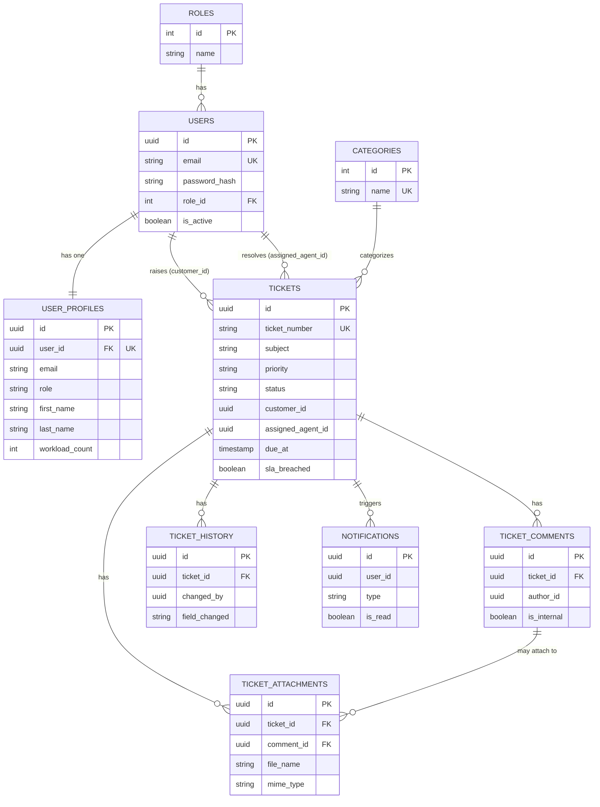

# Entity-Relationship Diagram

Full DDL: [`database/init.sql`](../database/init.sql). Diagram below
covers the MVP-relevant tables (notifications/audit_logs included for
completeness since their schema already exists for the next phase).

## Notes
- `customer_id` / `assigned_agent_id` on `tickets` are **plain UUID
  columns, not foreign keys** to `users` — ticket-service and
  auth-service are independently deployable and must not share a
  hard DB-level dependency. Identity is asserted via the JWT at
  request time instead.
- Indexing strategy and query-optimization notes are inline as SQL
  comments at the bottom of `database/init.sql` (composite index on
  `(status, assigned_agent_id)` for the agent dashboard query,
  keyset-pagination recommendation for ticket lists at scale).
