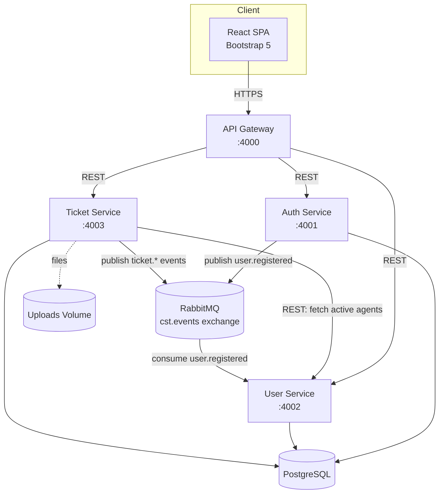

# High-Level Design (HLD)

## 1. Overview
The Customer Support Ticketing System is a microservices-based platform
enabling customers to raise support tickets, agents to resolve them,
managers to monitor SLAs/performance, and administrators to configure
the system.

**Scope of this build (MVP pass, agreed with stakeholder):** Auth,
User Management, and Ticket Management (creation, comments,
attachments, status workflow, dashboards). Notification Service and
Reporting Service are designed for (schema, event routing keys already
in place) but not implemented as standalone services in this pass —
see `PRODUCTION_READINESS_CHECKLIST.md` for the full follow-up list.

## 2. Architecture Style
True microservices, one deployable unit per bounded context, communicating via:
- **Synchronous REST** for request/response needs (e.g. ticket-service calling
  user-service to fetch active agents for auto-assignment).
- **Asynchronous events over RabbitMQ** (topic exchange `cst.events`) for
  cross-service side effects that shouldn't block the request path
  (e.g. `user.registered` → user-service creates the profile row).

## 3. System Diagram

## 4. Services

| Service | Responsibility | Port | Owns |
|---|---|---|---|
| api-gateway | Single entry point, perimeter JWT check, routing, Swagger UI | 4000 | nothing (stateless) |
| auth-service | Registration, login, JWT issuance/refresh, password lifecycle | 4001 | `users` table |
| user-service | Profile, role, activation management; consumes `user.registered` | 4002 | `user_profiles` table |
| ticket-service | Ticket lifecycle, comments, attachments, SLA, categories | 4003 | `tickets`, `ticket_comments`, `ticket_attachments`, `ticket_history`, `categories`, `sla_configurations` |
| frontend | React SPA served via nginx | 3000→80 | — |

## 5. Cross-Cutting Concerns
- **AuthN/AuthZ:** stateless JWT (access + refresh), RBAC enforced both
  at the route layer (coarse permissions) and inside the domain state
  machine (fine-grained, e.g. exactly which role may perform which
  ticket-status transition).
- **Observability:** structured JSON logs (Winston) with a `traceId`
  generated at the gateway and forwarded through every downstream call,
  so a single request can be correlated across services in a log
  aggregator (ELK/CloudWatch/Loki).
- **Resilience:** each service retries its DB connection on boot;
  RabbitMQ publishers/consumers reconnect on connection loss; the
  gateway returns `502 BAD_GATEWAY` (not a hang) if a backend is down.
- **Independent deployability:** each service has its own
  `package.json`, `Dockerfile`, and vendored copy of the shared
  domain logic (`src/domain/*`) — no service imports another
  service's source at build time.

## 6. Data Ownership & Consistency
Each service owns its own tables; cross-service references are by
UUID only (no foreign keys across service boundaries — see
`database/init.sql` notes). Where a service needs another service's
data it either calls its REST API synchronously (ticket-service →
user-service for auto-assignment) or keeps a denormalized,
event-carried copy (user-service's `email`/`role` columns, populated
from auth-service's `user.registered` event) — the classic
microservices trade-off of eventual consistency in exchange for
independent deployability.
