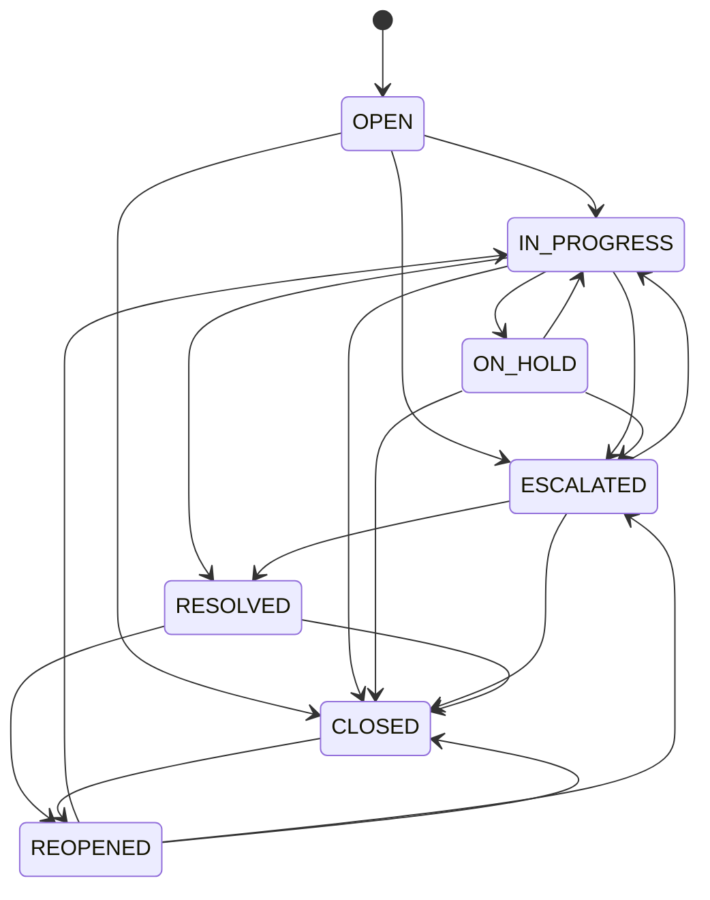
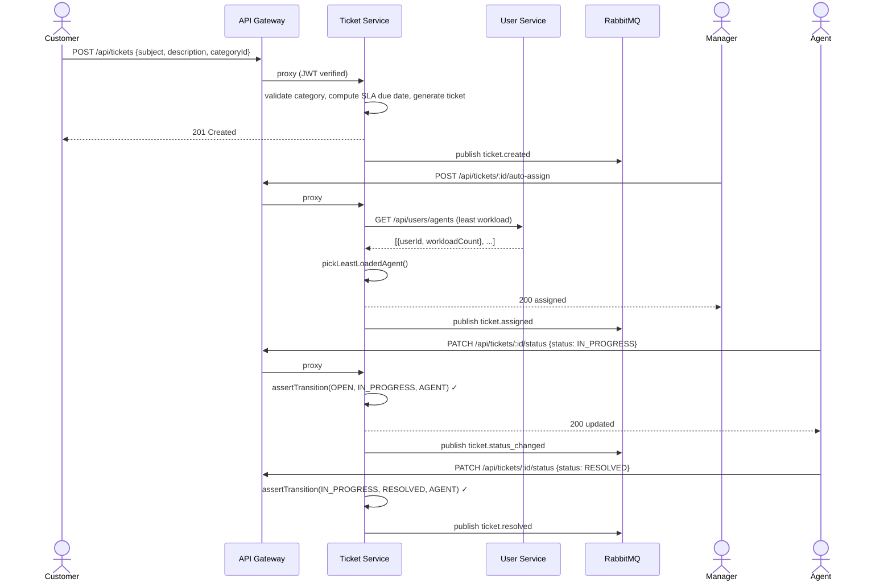
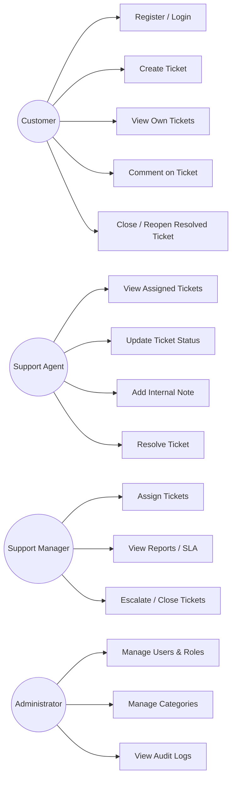

# Low-Level Design (LLD)

## 1. Layering (every backend service)

```
routes/        → wires URL + HTTP verb to a controller, applies
                  validateRequest(schema) and requirePermission()
controllers/    → thin: parses req, calls service, shapes response
services/       → all business rules live here (Service Layer Pattern)
repositories/   → only place Sequelize/SQL is touched (Repository Pattern)
models/         → Sequelize model definitions
domain/         → pure, framework-free business rules (state machine,
                  RBAC matrix, password policy, auto-assign) — the
                  same files are unit-tested directly with zero mocks
middleware/     → traceId, authenticate, validateRequest, errorHandler
validators/     → Joi schemas
events/         → RabbitMQ publisher/consumer
```

Dependency direction is strictly top-to-bottom; a lower layer never
imports a higher one (SOLID's Dependency Inversion — services depend
on repository *interfaces* in spirit; in JS that means services never
`require('sequelize')` directly, only the repository does).

## 2. Ticket Status State Machine
Implemented in `services/ticket-service/src/domain/ticketStateMachine.js`
(and vendored identically into the shared test suite). Key exports:

- `TRANSITIONS`: adjacency list of legal `from → [to...]` moves.
- `TRANSITION_ROLES`: per-transition allow-list of roles, e.g. only
  `MANAGER`/`ADMIN` may move `ESCALATED → CLOSED`, but `CUSTOMER` may
  move `RESOLVED → CLOSED` (confirming resolution) or `→ REOPENED`.
- `assertTransition(from, to, role)`: throws `InvalidTransitionError`
  (400 — structurally impossible move) or `ForbiddenTransitionError`
  (403 — structurally legal but this role can't do it) — mapped to
  HTTP codes in `ticketService.js`'s `mapDomainErrorToApiError`.



## 3. RBAC Matrix
Implemented in `domain/rbac.js`, vendored into every service that
needs it. Coarse permissions gate routes (`requirePermission`);
fine-grained, per-transition rules live in the state machine (see
above) because a single permission string can't express "customer may
close *their own resolved* ticket but not anyone else's open one" —
ownership is checked separately in `ticketService._assertCanView`.

| Permission | CUSTOMER | AGENT | MANAGER | ADMIN |
|---|:---:|:---:|:---:|:---:|
| ticket:create | ✅ | | | |
| ticket:view:own | ✅ | | | |
| ticket:view:assigned | | ✅ | | |
| ticket:view:all | | | ✅ | ✅ |
| ticket:comment:public | ✅ | ✅ | ✅ | |
| ticket:comment:internal | | ✅ | ✅ | |
| ticket:assign | | | ✅ | |
| user:manage / role:manage | | | | ✅ |
| report:view / sla:monitor | | | ✅ | |

## 4. Auto-Assignment Algorithm
`domain/autoAssign.js` → `pickLeastLoadedAgent(agents)`: pure function,
`O(n)`, picks the active agent with the smallest `workloadCount`. The
count itself lives in `user_profiles.workload_count`, incremented /
decremented by `userProfileRepository.incrementWorkload()` — wired for
manual invocation today; a production hardening step is to trigger
that increment/decrement from the `ticket.assigned` /
`ticket.status_changed` (→ RESOLVED/CLOSED) events via a consumer in
user-service, keeping the counter authoritative without ticket-service
needing to know about it (documented in the readiness checklist).

## 5. Key Sequence: Create Ticket → Auto-Assign → Resolve



## 6. Use Case Diagram


